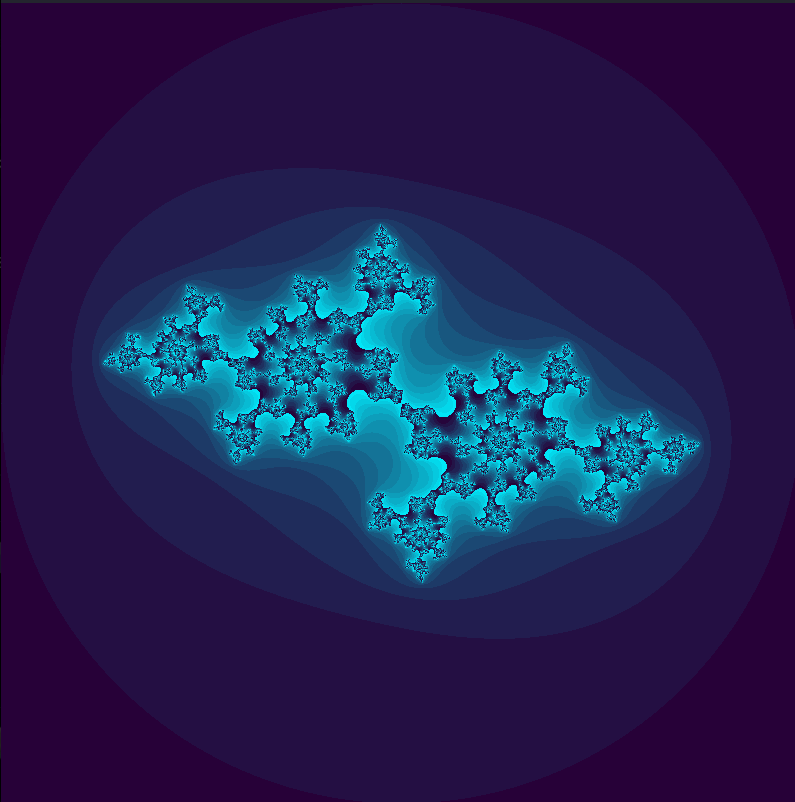
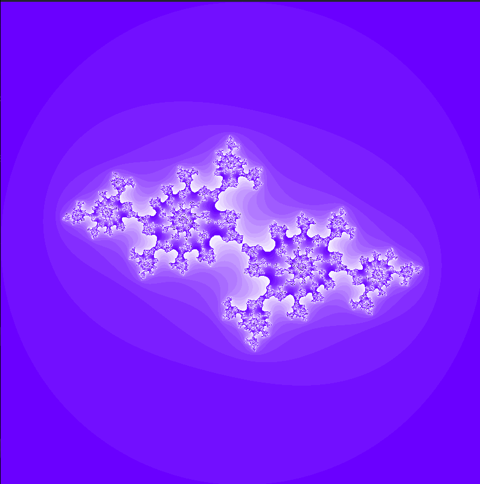
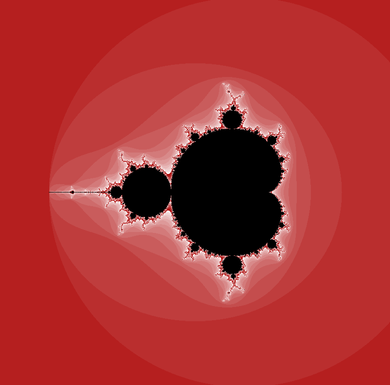
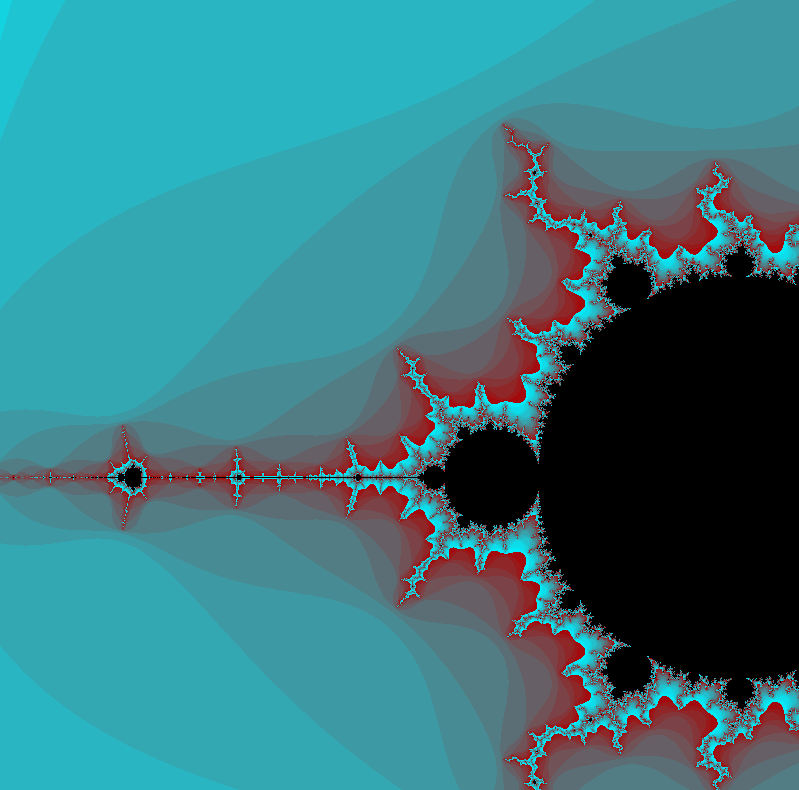

# Fractol

## Summary

- [Requirements](#requirements)
- [Instalation](#instalation)  
- [Usage](#usage)
- [Controls](#controls)
- [Screenshots](#screenshots)


### Requirements

- Linux OS
- The libs `xorg`, `x11`, `zlib` and `make` 
```bash
sudo apt-get update && sudo apt-get install xorg libxext-dev zlib1g-dev libbsd-dev make
```


### Instalation

- First clone this repo
```bash
git clone git@github.com:vitoivan/42_fractol.git && cd 42_fractol
```
- Run `make` to compile the project


### Usage

```
./fractol [mandelbrot|julia] [julia required parameter]
```

### Controls

- **WASD** or **ARROW KEYS** to `move` the fractal
- **mouse SCROLL** to `zoom`
- **[1,2,3,4,5]** to change `colors`
- **ESC** or **Q** to `quit`


### Screenshots

